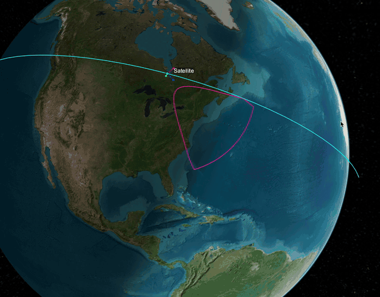

# ADCS — Attitude Determination and Control
My work on the attitude determination and control system for PVDX, Brown Space
Engineering's CubeSat. 

This is not the flight repository. Development happens upstream at: https://github.com/BrownSpaceEngineering/PVDX-ADCS and per-file authorship is noted under [What I did](#what-i-did--explanation).

## Signal chain

NASA returns the orbital elements of the satellite. These are propagated to find ECI position. The magnetosphere finds the reference magnetic field at the satellite's ECI position. This is fed into the MUKF along with photodiode and magnetometer measurements. The returning estimated quaternion and omega are fed into pointing_error to find the desired quaternion, which is then fed into the PD controller to command a torque.

`propagate_orbital_elements` → `magnetosphere` → `MUKF` → `pointing_error` →
`PD_controller`

`Bdot` is not part of that chain — it's a separate detumble mode that runs on
magnetometer data alone, before the pointing loop takes over.

## Demo

MATLAB Satellite Scenario Viewer from Simulink model, 50x real time, tracking Providence Rhode Island.

<p align="center">
  <br>
  <em>Sensor footprint tracking Providence, 50× real time</em>
</p>

## Performance
I ran many simulations in Simulink to test the preformance of the full algorithm. 


### Test conditions

- **Orbit:** 408 km altitude (a = 6 786 233.13 m), 51.6° inclination, 7.1e-5 eccentricity
- **Inertia:** diag(0.0301, 0.0114, 0.0231) kg·m² — the model uses the full tensor;
  products of inertia are I_xy = −5.17e-5, I_xz = 2.51e-5, I_yz = −3.65e-3 kg·m²
- **Sensors:** magnetometer 10 nT (1σ) on a 10 s cadence, photodiodes **not modeled**
  (the 2-vector mode substitutes a fixed ECI reference vector `[1 0 0]` with 0.01 1σ
  unit-vector noise), gyro 0.057 °/s noise + (0.115, −0.057, 0.086) °/s constant bias,
  sampled at 10 Hz
- **Actuators:** **ideal torque actuators** — the plant applies the commanded body torque
  directly, with no magnetorquer dipole model and no saturation limit
- **Simulation:** ___ s stop time, ___ solver at ___ s step, `Seed = 0`

### Monte Carlo Validation on PD controller 
A 100 trial monte carlo simulation ran to 300 s with randommized intital angular velocity and attitude to test PD settling. 

<p align="center">
  <br>
  <em>Results from 100 trial monte carlo simulation wiht randomized initial conditions to test PD controller settling</em>
</p>

| Metric | Value |
|---|---|
| Settled within tolerance (2.00°) | 100/100 (100%) |
| Settling time — mean | 53.6 s |
| Settling time — 95th pct | 60.0 s |
| Settling time — max | 65.0 s |
| Steady-state error — mean | 0.5538° |
| Steady-state error — RMS | 0.6103° |
| Steady-state drift | -3.44×10⁻³ °/s |

### Attitude accuracy from MUKF
Error between estimated quaternion and bias and true quaternion and bias, over 6 hour run in alternating measurement mode

<p align="center">
  <br>
</p>

<p align="center">
  <br>
</p>


| Value | Mode | RMS error | 3-sigma | max |
| --- | --- | --- | --- |
| q_estimate | 2-vector (sun + magnetometer) | 0.753° | 1.454° | 4.104° |
| q_estimate | 1-vector (magnetometer only) | 3.150° | 4.712° | 7.002° |
| Gyro bias | 2-vector| 0.009 °/hr | 0.023 °/hr | 0.170 °/hr |
| Gyro bias | 1-vector | 0.007 °/hr | 0.007 °/hr | 0.012 °/hr |

### Pointing Error
Degree of error away from pointing at providence, with the first 300s (settling) excluded

<p align="center">
  <br>
</p>

| Mode | RMS | 3-sigma | Max |
| --- | --- | --- | --- |
| 2-vector (sun + magnetometer) | 0.765° | 1.231° | 3.878° |
| 1-vector (magnetometer only) | 3.579° | 6.490° | 9.745° |

### Component verification
Individual tests for each script.

| Component | Checked against | Agreement |
| --- | --- | --- |
| `propagate_orbital_elements` | `propagateOrbit` / `ijk2keplerian` | 1e-8° over a 2 h arc, e in [0.05, 0.95] |
| `magnetosphere` | `wrldmagm` | exact to 10 different common locations |
| `pointing_error` | Aerospace Blockset nadir-pointing block | exact over 20000s orbit |

## Running it

Open [`CubeSatSimulationProject.prj`](MATLAB/Simulink/CubeSat%20Simulation%20Project-3/CubeSatSimulationProject.prj),
then open `CubesatModel/asbCubeSat.slx` and run. The algorithms in
[`MATLAB/Algorithms/`](MATLAB/Algorithms) are called from MATLAB Function blocks
inside that model.

Requires MATLAB, Simulink, Aerospace Blockset, and Aerospace Toolbox.

To run the Monte Carlo study, open the file in matlab with the Simulink model open, then call

```matlab
r = runCubeSatMonteCarlo(NumTrials=100, StopTime=900, SettleTolDeg=1.5);
summary(r)
```

## Repository layout

| Path | Contents |
| --- | --- |
| [`MATLAB/Algorithms/`](MATLAB/Algorithms) | The algorithms, as standalone `.m` files |
| [`MATLAB/Simulink/CubeSat Simulation Project-3/`](MATLAB/Simulink/CubeSat%20Simulation%20Project-3) | The full Simulink project and model |
| [`MATLAB/docs/`](MATLAB/docs) | Demo gif |
| [`C/`](C) | C port, other algorithms to be added |


## What I did / Explanation

### Orbit propagation — [`propagate_orbital_elements.m`](MATLAB/Algorithms/propagate_orbital_elements.m), [`test_propagate_orbital_elements.m`](MATLAB/Algorithms/test_propagate_orbital_elements.m)
- Finds orbital elements of satellite at some future time through solving Kepler's equation with Newton's method. Tested against Aerospace Toolbox functions `propagateOrbit` / `ijk2keplerian` with an eccentricity between 0.05-0.95 with 1 minute steps over a 2 hour arc, accurate to 1e-8 deg.
- Ported to C in [`C/propagate_orbital_elements.c`](C/propagate_orbital_elements.c) for flight software, with a `testKepler` helper that feeds 2 hours of true anomaly to a text file to diff against the MATLAB version.

### Geomagnetic field — [`magnetosphere.m`](MATLAB/Algorithms/magnetosphere.m)

WMM2025 spherical-harmonic field model. I integrated it into the Simulink control model with the UKF and pointing (feeds into it the reference ECI vector), debugged Simulink compile issues and NED/ECI bug, and tested it against MATLAB's wrldmagm function. Originally written by @contextneeded.

### Attitude estimation — [`MUKF.m`](MATLAB/Algorithms/MUKF.m)

Multiplicative unscented Kalman filter, 6-state error
(3 attitude + 3 gyro bias), 13 sigma points, switching between a two-vector
(sun + magnetometer) and magnetometer-only measurement mode, filter core written by @david-man. I got it to work with the PD controller in the Simulink model. Specific fixes I did:

- **`omega_icrf2b` 0 in Simulink** - fed in w_eci2b output from the dynamics block, changing the convention from NED and reconfigured quaternion outputs to match, to avoid quaternion finite difference inaccuracy
- **Quaternion backwards bug** - identified and helped fix a bug in quaternions being inverted (active vs passive convention) causing w_estimate to be off.
- **1 vector model drift with PD** - debugged an issue with 1 vec model drifting up to 30 deg of accuracy when used with PD controller due to generated w_measured bug
- **Verified Accuracy with PD controller** - wrote a small script [`Error.m`](MATLAB/Algorithms/Error.m) to find rotation error between q_est and q_true (see [Performance](#performance)) for more on the testing. 

### Pointing error — [`pointing_error.m`](MATLAB/Algorithms/pointing_error.m)
- Builds the desired body frame for a ground-station target (Providence,
RI) from the satellite's ECI position and velocity, converts it to a
quaternion, and returns the error quaternion in body coordinates.
- Handles quaternion sign flip at 180 degree: the commanded quaternion is compared against the previous timestep's via a persistent variable and sign-flipped when the dot product goes negative, so the target attitude doesn't jump discontinuously between equivalent representations.
- Tested against Aerospace Toolbox nadir-pointing block. Added Providence pointing capability by converting Providence ECEF coordinates to ECI each timestep.

### PD controller — [`PD_controller.m`](MATLAB/Algorithms/PD_controller.m)
- Converts the error quaternion and body rates to axis-angle, applies proportional and derivative gains per axis, scales by the measured inertia tensor, and saturates the commanded torque.
- Takes the shortest-rotation so that when the scalar of q_error is negative, it negates the quaternion and has small-angle guards on both the axis extraction and the rate normalization. Co-developed with @aPizzaRat.


### Detumbling — [`Bdot.m`](MATLAB/Algorithms/Bdot.m)

Implemented B-dot control law
- Uses finite-differences in the body-frame magnetic field
to command a magnetic dipole opposing the rate of change.

### Monte Carlo verification — [`runCubeSatMonteCarlo.m`](MATLAB/Simulink/CubeSat%20Simulation%20Project-3/runCubeSatMonteCarlo.m)

- Configurable trial count, stop time, attitude sampling mode (uniform or
axis-angle with tilt bounds), rate range, settling tolerance, steady-state
window, and RNG seed; returns one row per trial and plots the summary.
Initial conditions are injected with `Simulink.SimulationInput`, so the model on
disk is never modified. Wrote with Claude. 

## Simulink model

[`MATLAB/Simulink/CubeSat Simulation Project-3/`](MATLAB/Simulink/CubeSat%20Simulation%20Project-3) is built on the MathWorks Aerospace Blockset
CubeSat Simulation project. I integrated all the above algorithms into the full control loop for the satellite.
